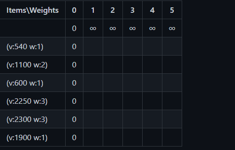
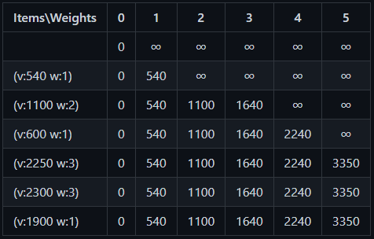

<h1>How did this start?</h1>

This small project started as a question/challenge in a gaming discord about the best way to buy items on the marketplace, I wasn't sure how to do it but was intrigued by it. I drafted a bunch of pseudo code to try to tackle the problem to little avail, but it helped me understand the problem better and eventually search for the well known problem of the Knapsack Problem, specifically the 0/1 Knapsack Problem. This one had a twist however, instead of the common example of best profit for a given carrying capacity, we were searching for the solution that filled the bag with the minimum cost. It was somewhat annoying to get to this variant's solution, so here I am sharing hopefully so it helps somebody else.

<h1>The problem</h1>
On an online card game called Splinterlands there's a game mechanic of leveling up cards by combining multiple of the same card so it becomes better overall or enable other higher level cards to be played. So take for instance a card that need 5 cards combined to get to level 3: you could buy one from another player as a level 3, or buy 5 units of it and combine it to level 3, or buy a level 2 (3 units) and a level 1 with 2 units in it. It can seem easy, but sometimes the optimal solution is not obvious. Let me try to build an example:

 

| Units |   Price   |
| ----- | :-------: |
| 11    |   5777    |
| 1     |    540    |
| 2     |  1100.0   |
| 1     |   600.0   |
| 11    |  6999.0   |
| 3     |  2250.0   |
| 3     |  2300.0   |
| 11    | 10369.369 |
| 1     |  1900.0   |

 

 
For this scenario if the case was so that a player was looking for a 11 units card, the choice was straight forward with the first option. In the case of a 5 units card, at first glance it's normal to choose the cheapest unit costing 540 and continue from there, however the optimal solution is choosing the one that costs 1100 and the one that costs 2250.

<h1>How does the solution work?</h1>

The solution works by reducing the problem into a smaller version of itself, where you go item by item choosing the best solution for a smaller bag and improve upon it when enhancing the bag capacity. It can be confusing to understand so I made gifs of the algorithm progressing.
 

Choosing the minimum cost possible

 
Start by making a matrix of size n+1 by m+1 where n is the number of candidates to be bought (filter out the ones that are too big for the bag since they'll only slow down things) and m is the size of the bag. Rows will correspond to candidates, whereas columns will represent weights of progressively bigger bags. The first column of the matrix should be filled with zeroes and the first row apart from the first cell should hold plus infinity.

From there start evaluating the items going cell by cell, row by row: if the item does not fit in a column's bag size, copy the value of the cell directly above it, if it fits, evaluate whether the current items value plus the value in the cell on the row above it but w times to the left (w being the weight of the current item) is lower than the value of the cell above it, if so, that's the current's cell value and current best for that bag size. Continue on until all the cells are filled with values.

Once it's done the value on the lower right corner of the matrix is the lowest possible cost for filling the bag, now it's time to find out which items were chosen.

Start on the lower right corner of the matrix: compare the value on the current cell with the one above it, if it didn't change it wasn't chosen, so go to the cell above it and repeat the comparison. Once the value changes, the item was one of the chosen, so save it, go to the row above it and w cells to the left, w being the weight of the item that was just found to be chosen. Repeat the process of comparing cell values until it gets to the column 0, meaning you have the optimal solution and items that make it.
 

 

Finding out which items were chosen

 

<h1>How to use the functions?</h1>

If you come from Splinterlands and wants to find the best cards to buy, use BestCardsChoice.py script, ex: `python BestCardsChoice.py 22 false 1 5` for the card with id 22, non foil, edition 1 and 5 bcx. If the logic is all you want check out KnapsackSolution.py, everything for the Knapsack problem itself is there.

<h1>More about the Knapsack Problem </h1>

If you want to know more and get nerdy on this subject I recommend a paper called 'An Effective Dynamic Programming Algorithm for the Minimum-Cost Maximal Knapsack Packing' by Fabio Furini, Ivana Ljubic and Markus Sinnl, it was what I partially read before writing this and goes way beyond what was done here, so it should be interesting.
